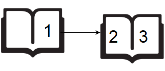
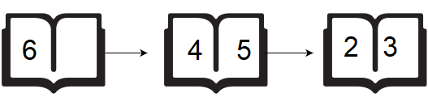

Drawing Book
=============================

A teacher asks the class to open their books to a page number. A student can either start turning pages from the front of the book or from the back of the book. They always turn pages one at a time. When they open the book, page `1` is always on the right side:

When they flip page 1, they see pages 2 and 3. Each page except the last page will always be printed on both sides. The last page may only be printed on the front, given the length of the book. If the book is `n` pages long, and a student wants to turn to page `p`, what is the minimum number of pages to turn? They can start at the beginning or the end of the book.

Example:
```
[in]
6  # n
2  # p

[out]
1
```

If the student starts turning from page `1`, they only need to turn `1` page:



If a student starts turning from page `6`, they need to turn `2` pages:



Return the minimum value, `1`.